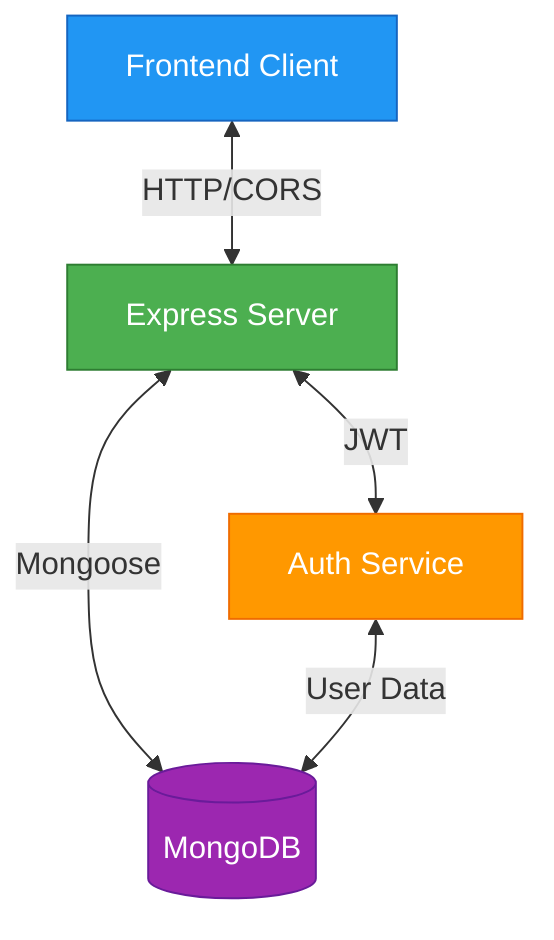
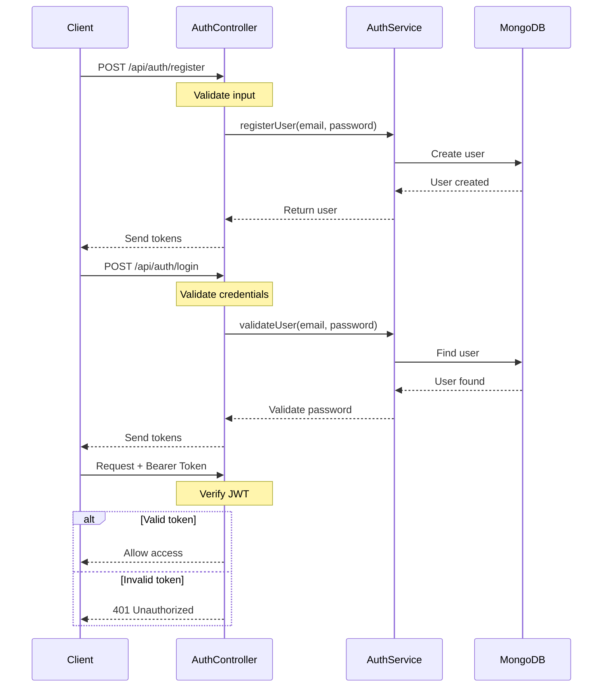
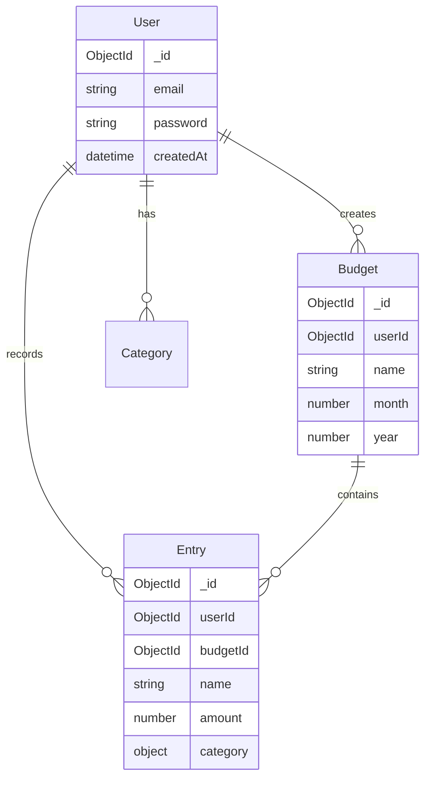
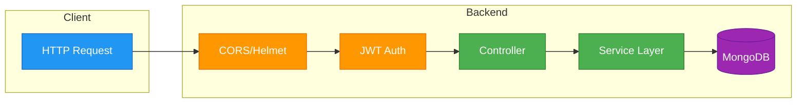
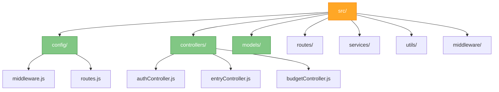

# Exelaki Backend Architecture

## 1. System Architecture



## 2. Authentication Flow



## 3. API Routes Structure

```mermaid
graph LR
    API[/api]
    Auth[/auth]
    Entries[/entries]
    Budget[/budget]
    Categories[/categories]
    FinScore[/financial-score]
    
    API --> Auth & Entries & Budget & Categories & FinScore
    
    Auth --> Register[POST /register]
    Auth --> Login[POST /login]
    Auth --> Refresh[POST /refresh-token]
    
    Entries --> AddEntry[POST /]
    Entries --> GetEntries[GET /]
    Entries --> EditEntry[PUT /:id]
    Entries --> DeleteEntry[DELETE /:id]
    
    style API fill:#2196F3,stroke:#1565C0,color:white
    style Auth fill:#4CAF50,stroke:#2E7D32,color:white
    style Entries fill:#4CAF50,stroke:#2E7D32,color:white
    style Budget fill:#4CAF50,stroke:#2E7D32,color:white
```

## 4. Data Models



## 5. Request Flow



## 6. Directory Structure



## 7. Key Components Reference

### Authentication Controller
```javascript:src/controllers/authController.js
startLine: 6
endLine: 102
```

### Middleware Configuration
```javascript:src/config/middleware.js
startLine: 5
endLine: 19
```

### Route Configuration
```javascript:src/config/routes.js
startLine: 7
endLine: 19
```

This architecture document provides a visual representation of the system's structure and interactions. The diagrams are color-coded for better understanding of different components and their relationships.